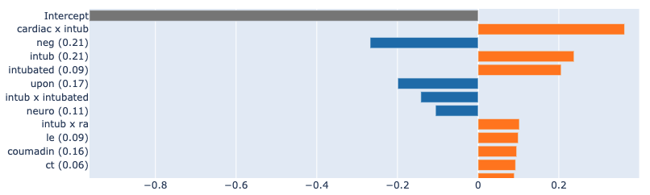
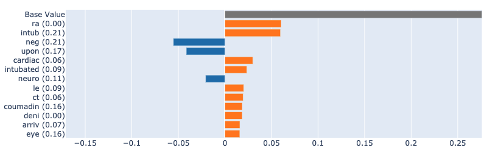
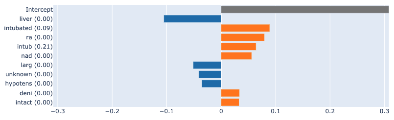
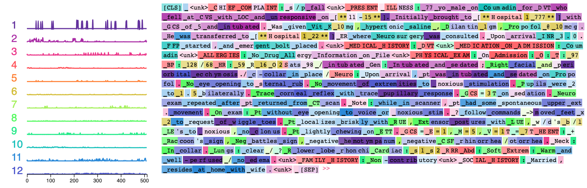

# Supplemental Material for IMLH 2021 Submission
This is the location for code and supplemental material for the IMLH 2021 paper on Quantifying Explainability (link coming soon).

## Code 
A standalone script for our document perturbation method is provided in [`input_perturbation.py`](./input_perturbation.py) - it can perform token replacement using either an embedding matrix (e.g., for a HuggingFace Transformer model like our BigBird classifier) or a Gensim word2vec-style object containing word vectors. These techniques are used in the Jupyter notebook titled [`metric-implementation-with-perturbation-anonymized.ipynb`](./metric-implementation-with-perturbation-anonymized.ipynb), along with some EDA done during the development process. This notebook is where we implement a generalized local Lipschitz and calculate on a subset of documents, in addition to the same process for infidelity (via the Captum library).

**Please note:** this notebook takes 15+ hours to execute with the current selection of attribution methods, models, number of documents, and neighbors per document. We used a machine with 208GB RAM.

## Steps to Reproduce
1. Obtain access to [MIMIC data](http://mimic.physionet.org/)
2. Follow the dataset preparation steps in the [benchmark task repo](https://github.com/bvanaken/clinical-outcome-prediction)
3. Update location of stored data in notebook and execute

## Supplemental Figures and Notes
### Dataset Statistics
We use the mortality prediction task introduced in van Aken et al. (2021) as the basis for our experiments in explainability. The following table provides descriptive statistics of the simulated admission notes forming this task dataset.

| Component | Value |
| ----- | ----- |
| # Training Observations   | 33,989 |
| # Validation Observations | 4,918 |
| # Test Observations       | 9,829 |
| Class Imbalance           | 10.52\% positive |
| Document Length (Average) | 396.6 words |
| Document Length (95th Percentile) | 809.0 words |
| Document Length (99th Percentile) | 1,054.2 words |

### Bayesian Rule Lists: Example Rules
The following table shows 6 of the 50 rules learned by the classifier with depth-1 trees:

| Example Rules | 
| ----- |
| intub <= 0.0162 |
| intub <= 0.0162 |
| nad <= 0.0274 |
| unrespons <= 0.0538 |
| exert <= 0.0454 |
| metastat <= 0.0299 |

### Explainability Comparison: Truth vs. LIME vs. SHAP for EBM
In the images below, we can see a comparison of the attributions provided by LIME and SHAP against the true explanations from the "glassbox" EBM model. We can see that the results are similar to those for the logistic regression model: LIME identifies fewer features, with virtually none appearing in the true attributions. SHAP, on the other hand, identifies many of the true features, albeit with some discrepancies in the relative importance and unable to attribute interactions.

True attributions:

SHAP:

LIME:

### Transformer Explainability: Ecco
Another view of the Ecco visualization is provided below - all factors are highlighted, and we can see the sparklines provide additional spatial information within the input document.

